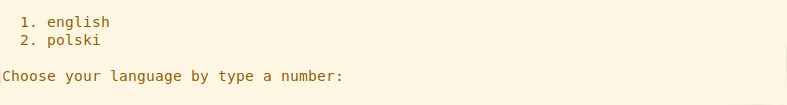
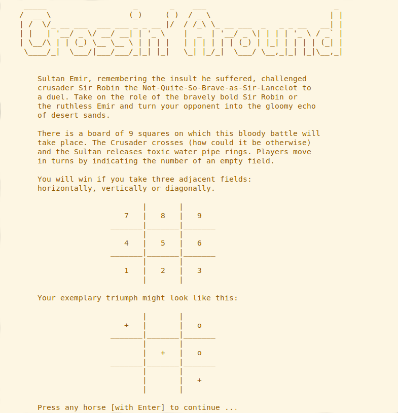
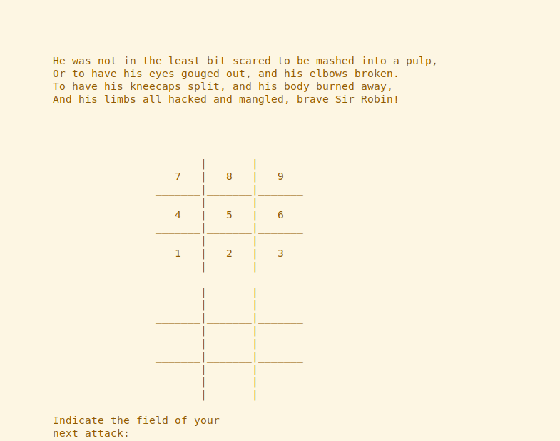
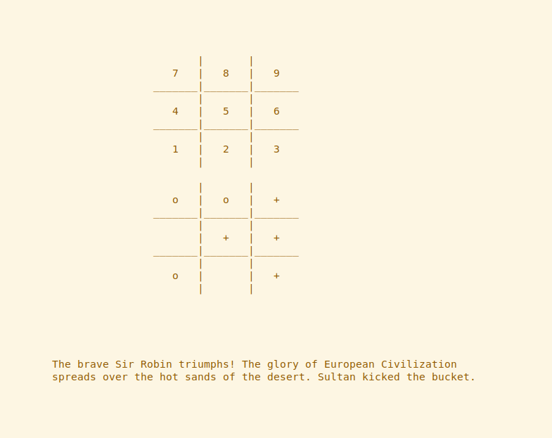
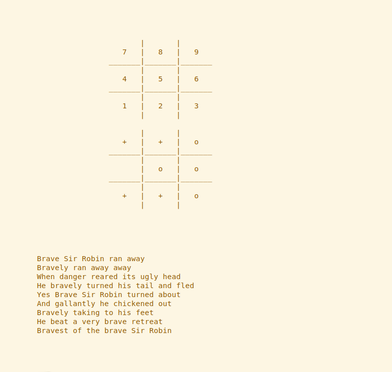
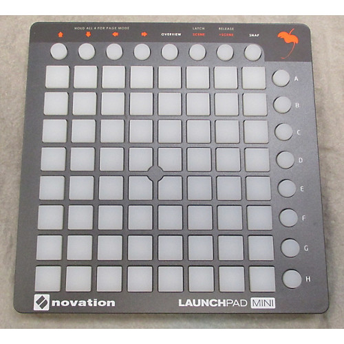

# Crossin' Around
## What is Tic-Tac-Toe and why it is important here?  
This is a game that I implemented in Python and made my own changes. Tic-tac-toe is a paper-and-pencil game for two players, X and O, who take turns marking the spaces in a 3×3 grid. The player who succeeds in placing three of their marks in a horizontal, vertical, or diagonal row is the winner.
  
## What is Crossin' Around?  
My extended version of the classic Tic-Tac-Toe. The game is played using the system console. Things added in my version:  
- two languages (english and polish) to choose at the beginning of the game  
- a small plot in which you play the crusader Sir Robin or sultan Emir  
- 'hot seat' mode - multiplayer game <wink, wink>  
- optional display of the game on an external device [Novation Launchpad Mini](https://novationmusic.com/launch/launchpad-mini) (If you want to read more about displaying via this launchpad [look at here](https://github.com/maciejjankowski/launchpad-mini-starter))  

## Setup and installation  
### Linux Ubuntu  
#### Preparation  
You need Python in version 3.x.x installed with [pip](https://pip.pypa.io/en/stable/) on your machine.  
Install optional packages required for python-rtmidi:
```bash
sudo apt-get install libasound2-dev
sudo apt-get install libjack-dev
```
Then create a virtual environment and install `python-rtmidi` module. `virtualenv` is used to isolate python modules so they don't pollute your system. `python-rtmidi` is a library for interacting with the system in order to access MIDI devices.  
```bash
virtualenv XXX
source XXX/bin/activate
pip install python-rtmidi
```  
#### Install and run the game  
Go to the directory where you want to install the game and type:  
```bash
git clone https://github.com/kMatejak/crossin_around/
cd crossin_around
python app.py
```
Remember, always start the game with the active virtual enviroment (that you created before).  
  
#### Play with Novation Launchpad Mini  
If you want to play along with displaying the game on an external device, just plug in the launchpad to your computer with a USB input.  
  
## Gameplay screenshots  
  
  
  
  
  
  
## Novation Launchpad Mini  
  
  
